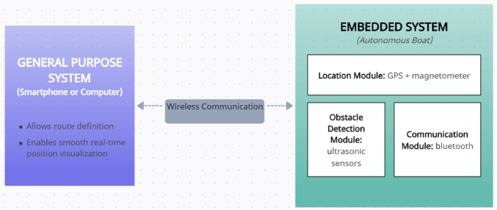
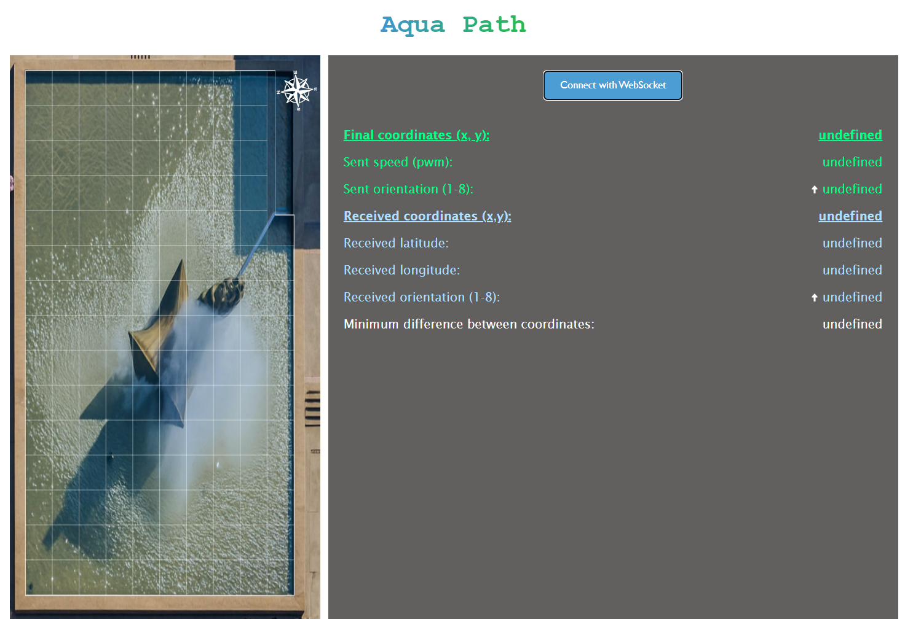

# AquaPath

This project is about developing an autonomous route-following boat that communicates in soft real time with a general-purpose device like a computer. Through a user interface, the route can be set and monitored live. The boat adjusts its path automatically if it encounters obstacles.

## Key Features
- Wireless Communication
Uses a module like the NRF24L01 for reliable, bidirectional communication with the base station (2.4GHz).

- Motor Control
Controls the boat’s movement and speed precisely.

- Obstacle Detection
Uses ultrasonic or laser sensors to detect and avoid obstacles during navigation.

- GPS Positioning
Provides continuous location tracking.

- Orientation Control
Includes a gyroscope and accelerometer (e.g., BMI160) for dynamic path correction and stability.

- User Interface
Displays a map with the boat’s real-time position, destination, and route progress.

- Power Management
Uses RP2040 sleep modes and efficient voltage regulators to extend battery life and maintain system stability.

## System Requirements
- Reliability: Must operate stably for at least 20 minutes continuously.

- Interoperability: Compatible with standard wireless protocols.

- Maintainability: Easy to update both firmware and user interface.

- Availability: 75% uptime minimum, with auto-recovery or user alerts on failure.

## Hardware setup within the embedded system

The image above shows how the sensors are connected to the Raspberry Pi Pico. The 1x3 pin headers are used for the servo motor and the brushless motor, the 1x5 pin header is connected to the GPS module, and the 1x2 pin header is for the system’s power supply.

## Interconnection Diagram

## Web Page Result

The image above shows the result of running the web page locally from this repository. By clicking the blue button, the page connects to the COM port associated with the classic Bluetooth module (in this case, an HC-06). Once the connection is established, the computer receives the boat’s real GPS coordinates and maps them to the closest point within the predefined grid.

**Note:** Before starting the embedded system's navigation and control process, it’s important to remap the grid’s corner coordinates based on the most recent GPS data.